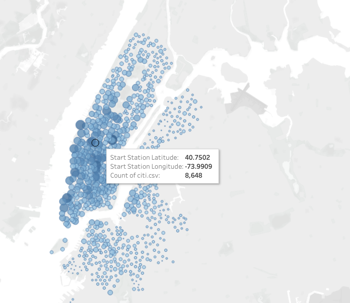
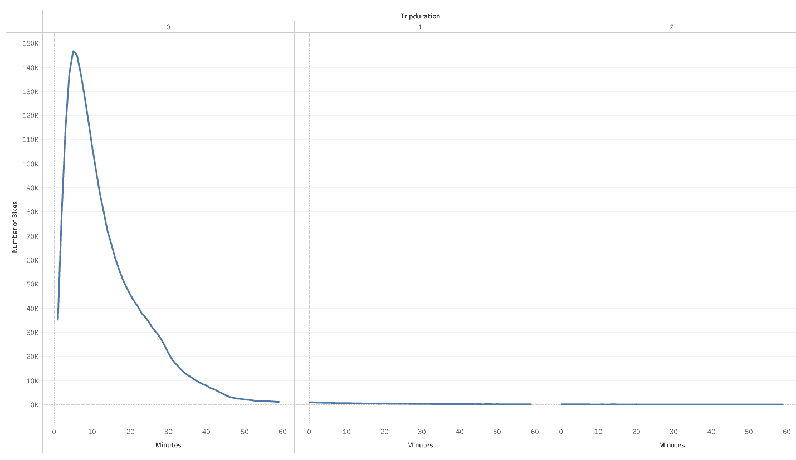
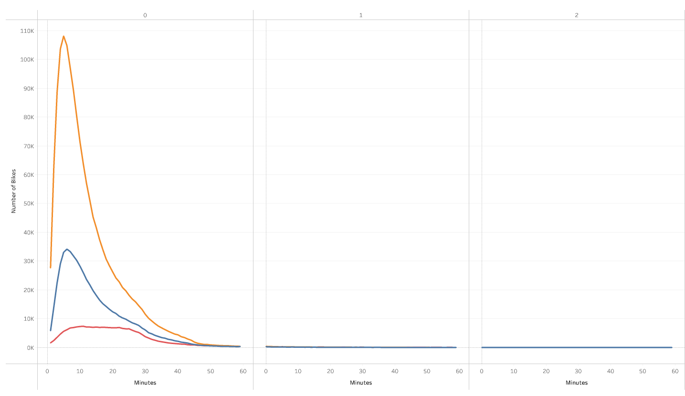
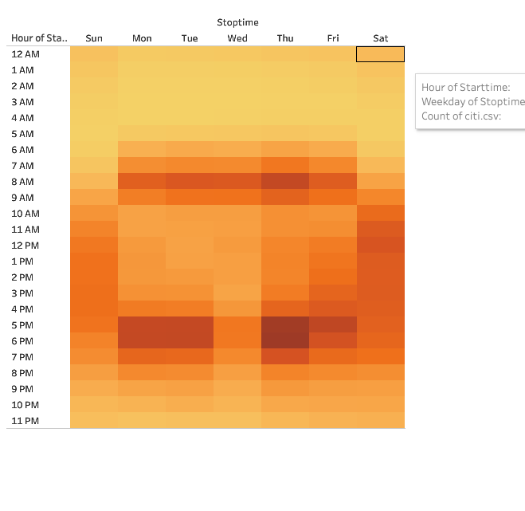
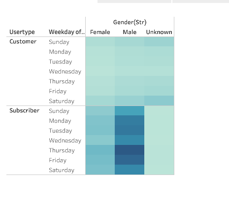
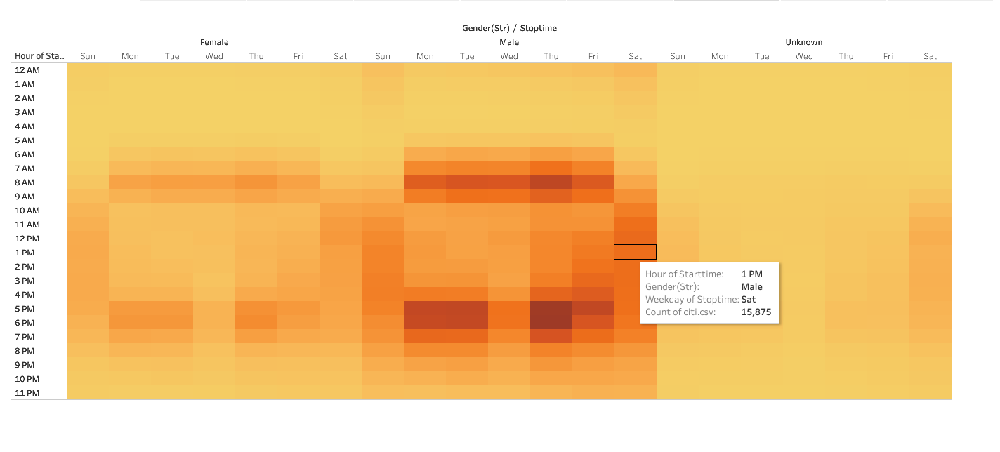
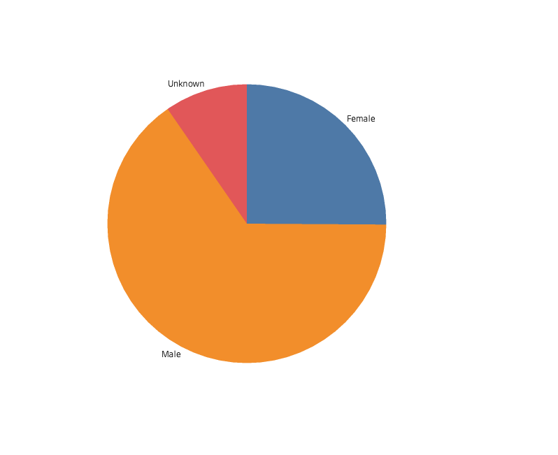

# bikesharing

## Overview 

The purpose of this analysis is to evaluate the Citi bike's business proposal in order to create a solid presentation for investors.  

## Results 
To tell this story, we decided to evaluate average user data and dive deeper into this data by user gender: 

- Citi bike is a strong opportunity with a growing user base that already sees heavy usage in the center of New York City with some users expanding into outer areas. 

- We start the analysis by looking at the average length of trip for all bike trips. It appears that most users finish their trip within 30 min. 

- Double clicking into this data, we see that the number of Men with trips of about 10 min greatly outnumber those by Women and Unknown genders. 

- Next, we took a look at which hours were most popular for  trips. We see that the heatmap has highest concentration when work hours are starting or stopping.

- Taking a look at which days are popular, we see that the highest concentration is on workdays. 

- Again, if we take a deeper look with Gender data, we see higher concentrated heat in Male users. 

- So what is the overall gender make up of Citi Bike users? We see that men greatly outnumber other genders in our user base. 

To view the full data story and interact with the data, visit here: [https://public.tableau.com/views/Challenge_16234486489100/CityBikeUse?:language=en-US&:display_count=n&:origin=viz_share_link](https://public.tableau.com/views/Challenge_16234486489100/CityBikeUse?:language=en-US&:display_count=n&:origin=viz_share_link "Challenge")

## Summary 

